# System Diagrams Documentation

This document contains Mermaid diagrams visualizing the SunHex Quantum Protocol API architecture, data flows, and request sequences.

## 1. System Architecture Diagram

### Component Overview

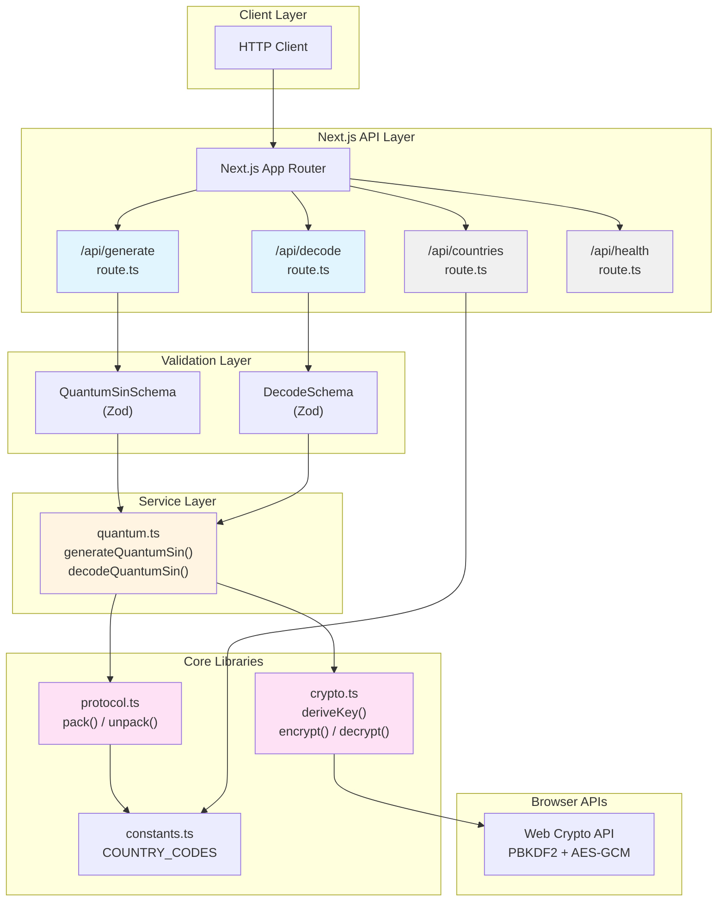

## 2. Request Flow Sequence Diagrams

### Generate Quantum SIN Sequence

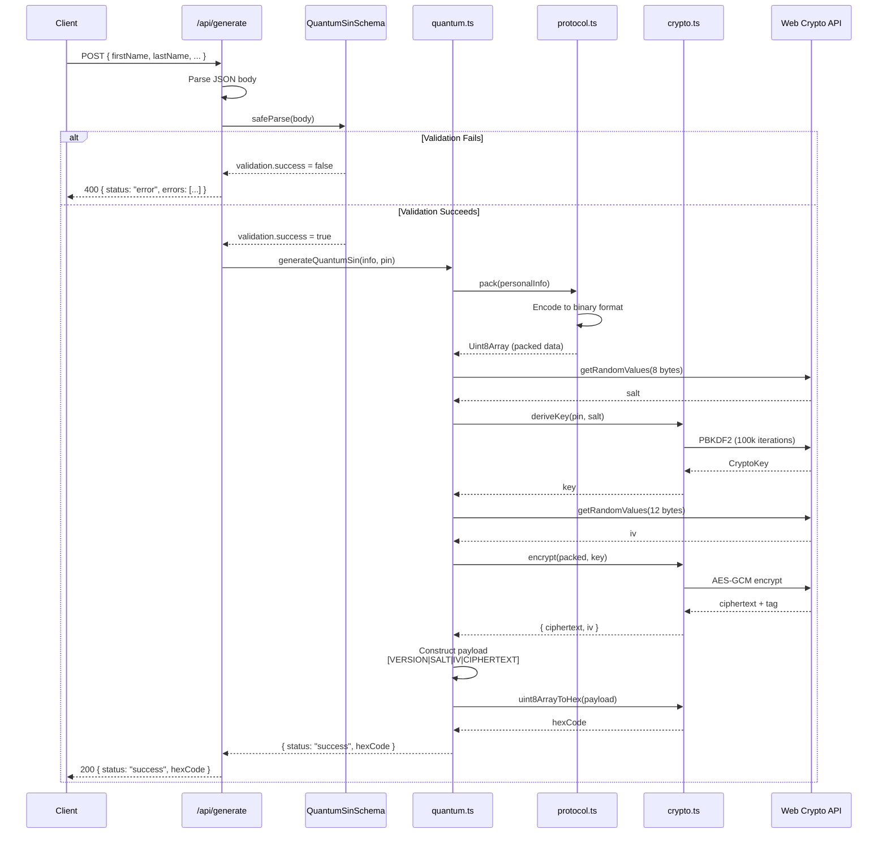

### Decode Quantum SIN Sequence

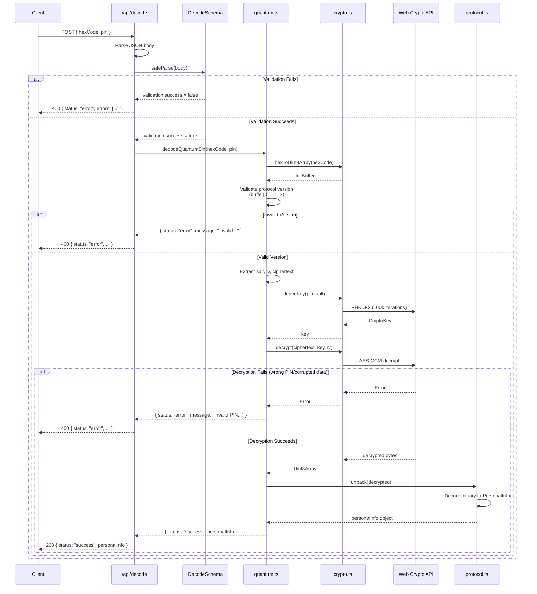

### Countries Request Sequence

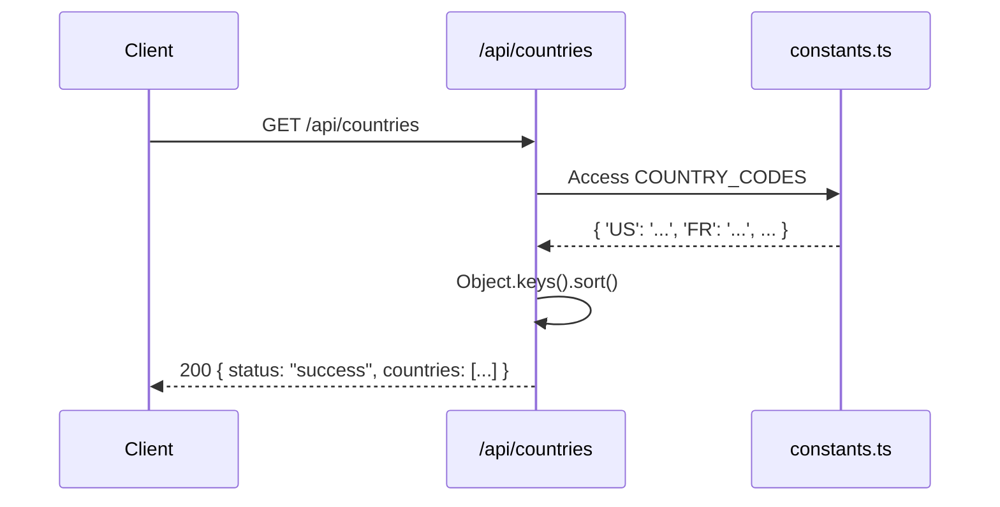

### Health Check Sequence

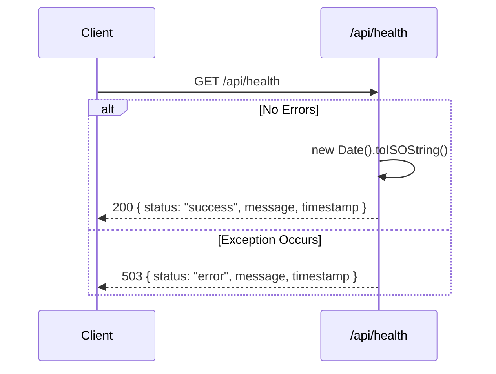

## 3. Data Flow Diagrams

### Encryption Data Flow

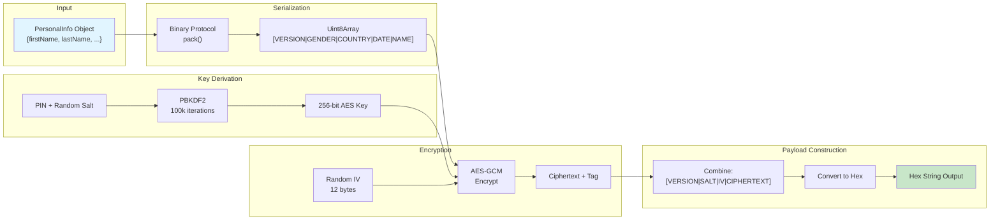

### Decryption Data Flow

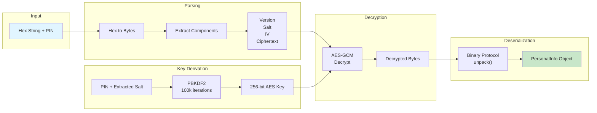

## 4. Cryptographic Process Diagram

### PBKDF2 Key Derivation + AES-GCM Encryption

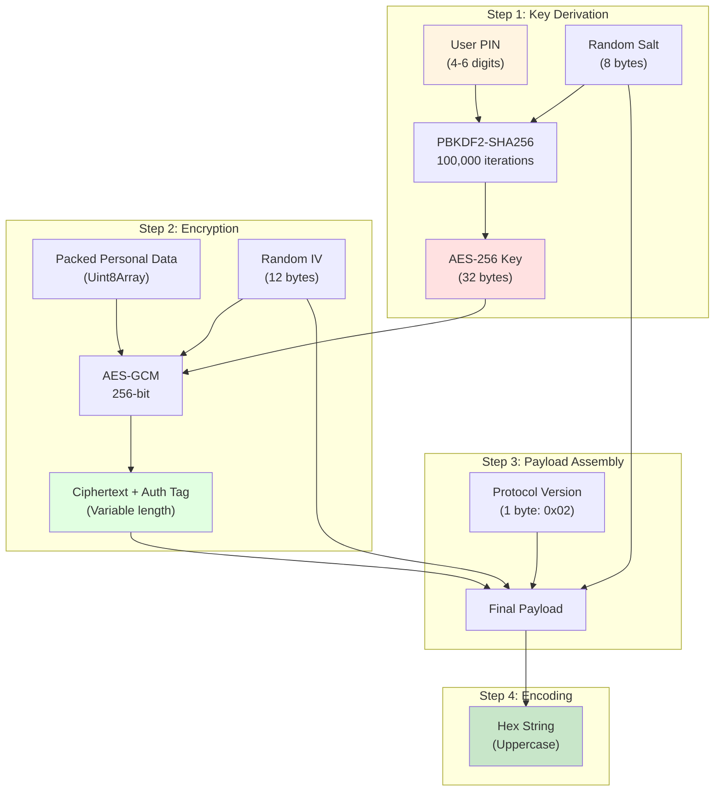

## 5. Error Handling Flow

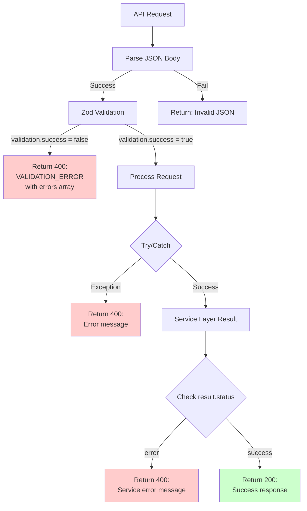

## 6. Binary Protocol Structure

### Encrypted Payload Layout

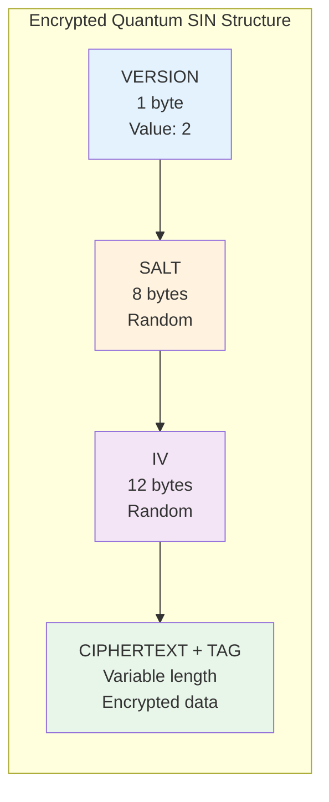

### Personal Info Binary Format (Before Encryption)

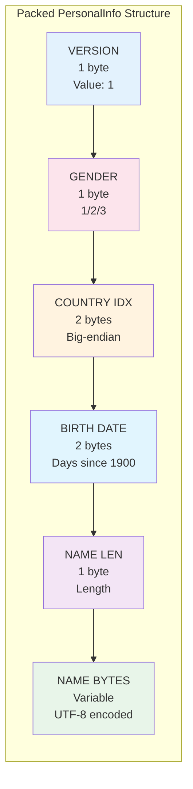

## 7. State Diagram

### API Request States

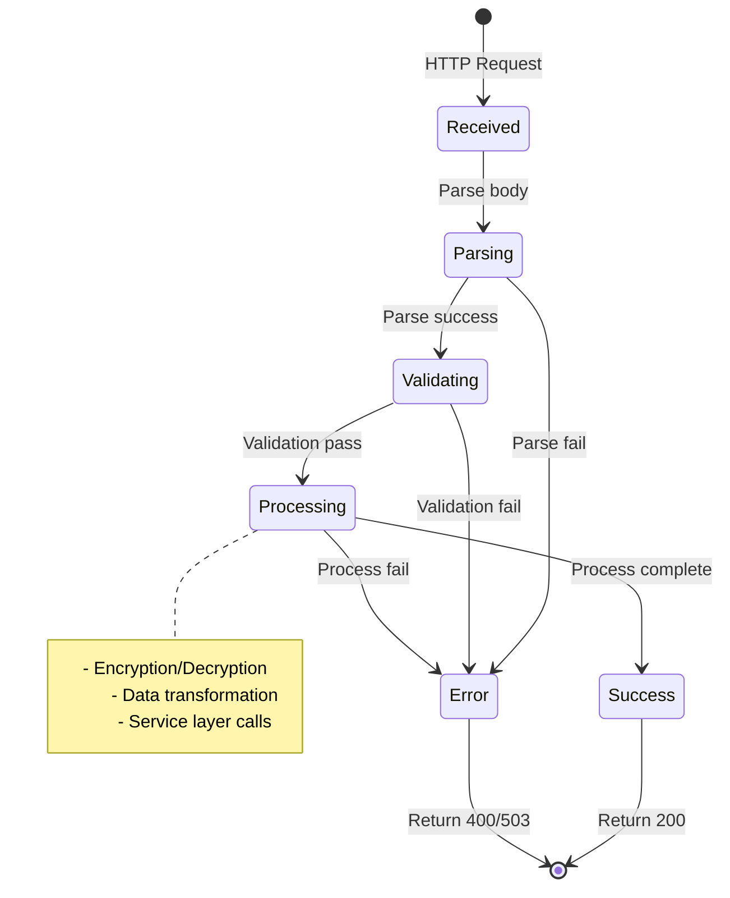

## Diagram Notes

### Rendering

All diagrams use **Mermaid** syntax and should render in:
- GitHub
- GitLab
- Markdown viewers with Mermaid support
- Documentation platforms (Docusaurus, MkDocs, etc.)

### Accuracy

All diagrams are based on **actual code implementation**. They reflect:
- Real file structure (`src/app/api/`, `src/lib/`, etc.)
- Actual function names (`pack()`, `encrypt()`, etc.)
- True data flows and transformations
- Correct cryptographic parameters (iterations, sizes, etc.)

### Not Included

These diagrams do **not** show:
- Authentication flows (not implemented)
- Database interactions (not applicable)
- Caching layers (not present)
- External API calls (none made)
- Deployment architecture (not determinable from code)

---

**Note**: All diagrams are generated based solely on the codebase implementation. No speculative or assumed components are included.
